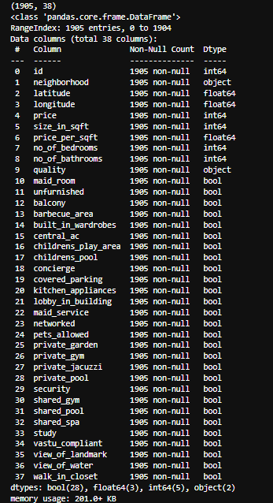
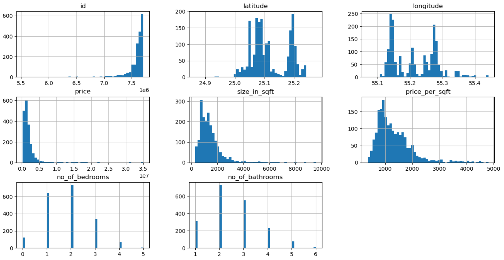
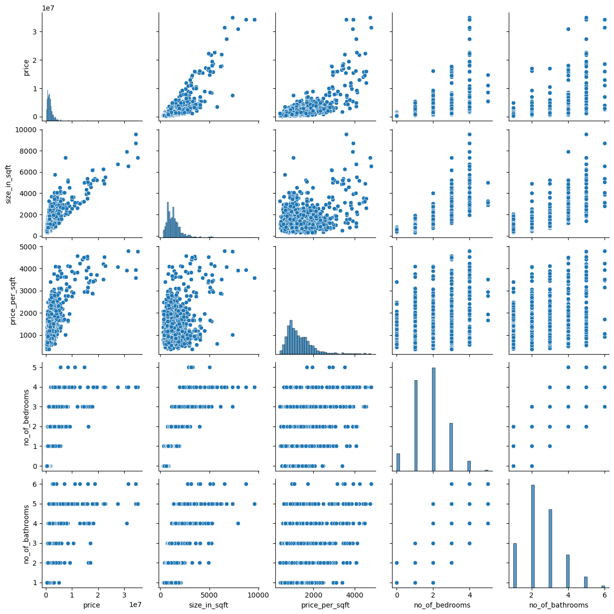
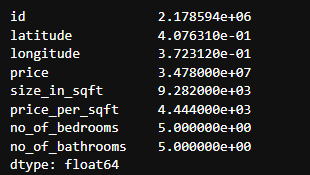

# Data-Cleaning-and-processing-using-python-Pandas
 Documentation of the data exploration, cleaning and processing stage of a real estate price prediction model in Dubai, UAE.
 
&nbsp;&nbsp;
 
Performed on a dataset with around **1.9k** entries with **38** features total

Data source: [Kento731](https://www.kaggle.com/datasets/kento731/housing-price-dubai-uae/data) (Kaggle)

1. Data exploration results :

Histograms (pandas) and Pairplots (seaborn) to visualize data distribution.

(full dataset pairplot available [here](Images/Pairplot_Fullset.png))

And the final step for this set is checking the feature ranges from peak to peak (numpy)

&nbsp;&nbsp;

2. Data processing steps:

